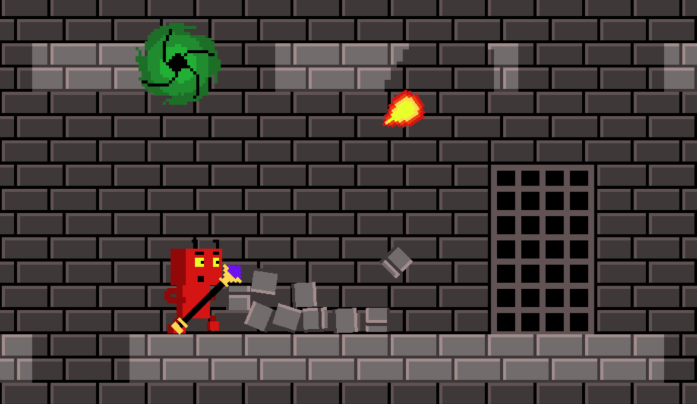

# Wofares Game Engine

**WOFARES** - **W**orld **OF** squ**ARES** is a platformer game engine innovatively designed around the concept of level destruction. It features a unique mechanism where tiles shatter into pieces, with fragments dispersing realistically thanks to the integration of the Box2D physics engine. This game engine is envisioned to support hot seat gameplay and single-player mode.

At the core of WOFARES's engine lies a robust foundation constructed using C++ and leveraging libraries such as SDL, EnTT, gml, imgui, and Box2D. A pivotal aspect of the game's design is the extensive application of the Entity Component System (ECS) pattern. This architectural approach significantly reduces component coupling and simplifies engine maintenance, ensuring a seamless and immersive gaming experience.

Here is a link to the game created with this engine for [LD55](https://ldjam.com/events/ludum-dare/55/ld55-hungry-portals) championship: [Hungry Portals (Web/Desktop)](https://marleeeeeey.itch.io/ld55-hungry-portals). Source code for the game is available [here](https://github.com/marleeeeeey/LD55_Hungry_Portals).

### Links to other documents

- [CHANGELOG.md](CHANGELOG.md) - Detailed history of changes in the project.
- [GUIDELINES.md](GUIDELINES.md) - Guidelines for development, assets editing, and comments.
- [BUILD.md](BUILD.md) - Instructions for building the project on Windows, Linux, and Web.

### Tools

- [Aseprite](https://www.aseprite.org/) - Animated sprite editor & pixel art tool.
- [Tiled](https://www.mapeditor.org/) - Flexible level editor.
- [Box2D](https://box2d.org/) - A 2D physics engine for games.
- [SDL](https://www.libsdl.org/) - Simple DirectMedia Layer.
- [EnTT](https://github.com/skypjack/entt) - A fast and reliable entity-component system (ECS).
- [sfxr](https://sfxr.me/) - Sound effect generator.
